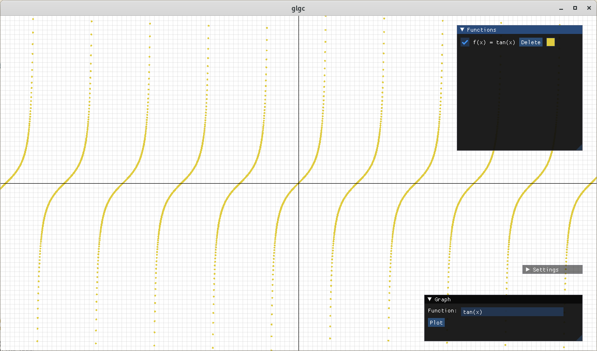

# glgc
SFML graphing calculator.

### Requirements
- [SFML](https://github.com/SFML/SFML)
- [ImGui-SFML](https://github.com/eliasdaler/imgui-sfml)

### 1.0 Changelog:
- Faster calculation
- Language selection menu (EN, TR)
- Antialiasing fix

